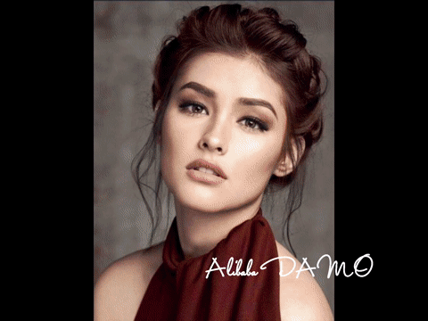
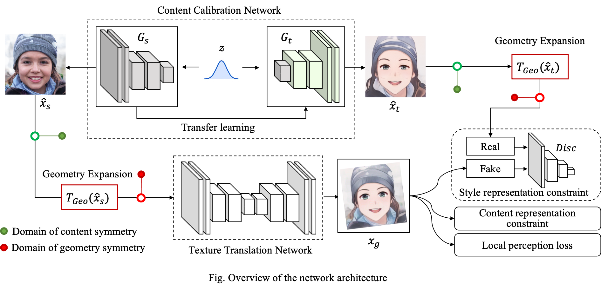

---
tasks:
- image-portrait-stylization
widgets:
  - task: image-portrait-stylization
    inputs:
      - type: image
        validator:
          max_size: 10M
          max_resolution: 3000*3000
    examples:
      - name: 1
        inputs:
          - name: image
            data: https://invi-label.oss-cn-shanghai.aliyuncs.com/label/cartoon/image1.png
    inferencespec:
      cpu: 2
      memory: 4000
      gpu: 1
      gpu_memory: 16000
model_type:
- GAN
domain:
- cv
frameworks:
- TensorFlow
backbone:
- UNet
metrics:
- realism
license: Apache License 2.0
language: 
- ch
tags:
- portrait stylization
- Alibaba
- SIGGRAPH 2022
datasets:
  test:
  - modelscope/human_face_portrait_compound_dataset
---

# DCT-Net人像卡通化模型-素描风

### [论文](https://arxiv.org/abs/2207.02426) ｜ [项目主页](https://menyifang.github.io/projects/DCTNet/DCTNet.html)

输入一张人物图像，实现端到端全图卡通化转换，生成素描风格虚拟形象，返回风格化后的结果图像。

其生成效果如下所示：




## 模型描述

该任务采用一种全新的域校准图像翻译模型DCT-Net（Domain-Calibrated Translation），利用小样本的风格数据，即可得到高保真、强鲁棒、易拓展的人像风格转换模型，并通过端到端推理快速得到风格转换结果。




## 使用方式和范围

使用方式：
- 支持GPU/CPU推理，在任意真实人物图像上进行直接推理;

使用范围:
- 包含人脸的人像照片（3通道RGB图像，支持PNG、JPG、JPEG格式），人脸分辨率大于100x100，总体图像分辨率小于3000×3000，低质人脸图像建议预先人脸增强处理。

目标场景:
- 艺术创作、社交娱乐、隐私保护场景，自动化生成卡通肖像。

### 如何使用

在ModelScope框架上，提供输入图片，即可以通过简单的Pipeline调用来使用人像卡通化模型。

#### 代码范例
```python
import cv2
from modelscope.outputs import OutputKeys
from modelscope.pipelines import pipeline
from modelscope.utils.constant import Tasks

img_cartoon = pipeline(Tasks.image_portrait_stylization, 
                       model='damo/cv_unet_person-image-cartoon-sketch_compound-models')
# 图像本地路径
#img_path = 'input.png'
# 图像url链接
img_path = 'https://invi-label.oss-cn-shanghai.aliyuncs.com/label/cartoon/image_cartoon.png'
result = img_cartoon(img_path)
cv2.imwrite('result.png', result[OutputKeys.OUTPUT_IMG])
print('finished!')

```

### 模型局限性以及可能的偏差

- 低质/低分辨率人脸图像由于本身内容信息丢失严重，无法得到理想转换效果，可预先采用人脸增强模型预处理图像解决；

- 小样本数据涵盖场景有限，人脸暗光、阴影干扰可能会影响生成效果。

## 训练数据介绍

训练数据从公开数据集（COCO等）、互联网搜索人像图像，并进行标注作为训练数据。

- 真实人脸数据[FFHQ](https://github.com/NVlabs/ffhq-dataset)常用的人脸公开数据集，包含7w人脸图像；

- 卡通人脸数据，互联网搜集，100+张

## 模型推理流程

### 预处理

- 人脸关键点检测
- 人脸提取&对齐，得到256x256大小的对齐人脸

### 推理

- 为控制推理效率，人脸及背景resize到指定大小分别推理，再背景融合得到最终效果；
- 亦可将整图依据人脸尺度整体缩放到合适尺寸，直接单次推理

## 数据评估及结果

使用CelebA公开人脸数据集进行评测，在FID/ID/用户偏好等指标上均达SOTA结果：

| Method | FID | ID | Pref.A | Pref.B | 
| ------------ | ------------ | ------------ | ------------ | ------------ |
| CycleGAN | 57.08 | 0.55 | 7.1 | 1.4 | 
| U-GAT-IT | 68.40 | 0.58 | 5.0 | 1.5 | 
| Toonify | 55.27 | 0.62 | 3.7 | 4.2 | 
| pSp | 69.38 | 0.60 | 1.6 | 2.5 |
| Ours | **35.92** | **0.71** | **82.6** | **90.5** |


## 引用
如果该模型对你有所帮助，请引用相关的论文：

```BibTeX
@inproceedings{men2022domain,
  title={DCT-Net: Domain-Calibrated Translation for Portrait Stylization},
  author={Men, Yifang and Yao, Yuan and Cui, Miaomiao and Lian, Zhouhui and Xie, Xuansong},
  journal={ACM Transactions on Graphics (TOG)},
  volume={41},
  number={4},
  pages={1--9},
  year={2022}
}
```
